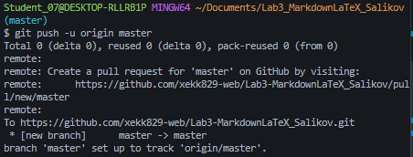

# Лабораторная работа №3. Работа с Markdown-разметкой и базовое использование LaTeX в документации проекта

Цель лабораторной заключается в изучении синтаксиса Markdown и LaTeX и практическое использование его в проекте.

---
### Содержание
1. [Структура проекта](#структура-проекта)
2. [Заголовки](#заголовки)
3. [Форматирование текста](#форматирование-текста)
4. [Списки](#списки)
5. [Цитата](#цитата)
6. [Блок кода](#блок-кода)
7. [Таблица](#таблица)
8. [Изображение](#изображение)
9. [Ссылки](#ссылки)
10. [Чекбоксы](#чекбосы)
11. [Сноска](#сноска)
12. [Alert-блоки](#alert-блоки)
13. [LaTeX](#latex)

---
### Структура проекта
1. `docs` - папка  с Markdown-файлами с использованием всего изученного синтаксиса
    * `advancedMarkdownLab3_Salikov.md`, `codeQuotesLab3_Salikov.md` и др. - сами файлы, разделённые по изученным категориям
2. `img` - папка со скриншотами пушей и дополнительными изображениями
3. `README.md` - файл описания проекта
---
### Заголовки

# Заголовок первого уровня - `#`
## Заголовок второго уровня - `##`
### Заголовок третьего уровня - `###`
#### Заголовок четвёртого уровня - `####`
---

### Форматирование текста
* `**полужирный**` - **полужирный**
* `*курсив*` - *курсив*
* `***полужирный курсив***` - ***полужирный курсив***
* `~~зачёркнутый~~` - ~~зачёркнутый~~
* `моноширный`

---

### Списки
1. это
2. нумерованный
3. внешний
    * это
    * маркированный
    * вложенный
4. списки

---

### Цитата
> Цитата цитата цитата
>> Вложенная цитата

---

### Блок кода
```csharp
int a = 10;
int b = 5;
Console.WriteLine($"Результат: {a * b}");
```

---

### Таблица

| Имя | Роль | Фраза |
| :--- | :--- | :--- |
| Артём | Кодер | "Привет, Мир!" |
| Марат | Тестер | "Семь раз проверь, один зарелизь" |

---

### Изображение



---

### Ссылки

1. [Документация C#](https://learn.microsoft.com/ru-ru/dotnet/csharp/)
2. [Markdown-файл по ссылкам](./docs/linksImagesLab3_Salikov.md)

---

### Чекбосы

- [x] Написать программу
- [ ] Сделать коммит

---

### Сноска

Тут текст[^1]

[^1]: А тут примечание

---

### Alert-блоки
> [!NOTE]
Заметка.

> [!TIP]
Не забудь сделать коммит.

> [!WARNING]
НЕ ЗАБУДЬ СДЕЛАТЬ КОММИТ!

---

### LaTeX
Площадь круга: $S = \pi r^2$

Дискриминант:
$$
D = b^2 - 4ac
$$